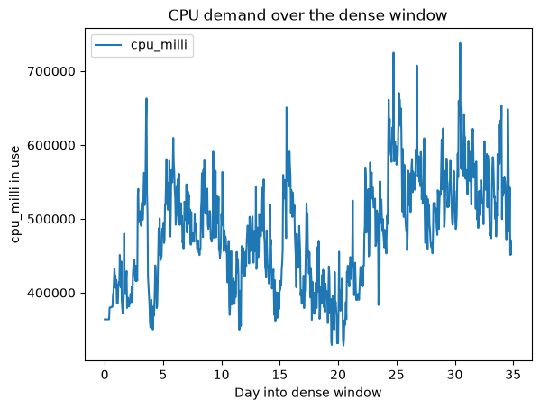

# Feature Engineering Notes

Running log of feature-engineering design decisions, in the same spirit as `docs/data_quality_notes.md` - so "why 15-minute buckets" has a documented answer, not just a number buried in code.

## The core problem: fact_pod_events isn't a time series

`fact_pod_events` has one row per pod, describing an *interval* (`creation_time` to `deletion_time`) - not a regular time series. A forecasting model needs the opposite: "at each point in time, how much total demand was there?" Turning intervals into a regular series is the first real feature-engineering step, done in `ml/features/resample_usage.py`.

## The technique: sweep line

Rather than checking, bucket by bucket, "which of the 8,152 pods were active during this window" (slow - that's buckets × pods comparisons), we use a **sweep line**: every pod's `creation_time` becomes a `+resource` event, every `deletion_time` becomes a `-resource` event. Sorting all events by time and walking through them once, keeping a running total, gives the *exact* resource usage at every moment in a single pass - regardless of how many pods there are or how fine a bucket size we later sample it at.

Implementation: `build_usage_step_function()` builds the sorted arrival/departure events; `sample_usage_at_times()` reads the running total at any set of timestamps via binary search; `build_bucketed_series()` combines both into regular fixed-size buckets. See `tests/ml/features/test_resample_usage.py` for a hand-checkable 2-pod example proving the overlap math is correct.

## Dense window scoping

Creation events are near-silent for the trace's first ~114 of 149 day (~26 pods total), then dense for the remaining ~35 days (~8,126 pods). Feature engineering is scoped to this dense window only (`9,891,350` to `12,901,761` seconds of trace time, ~34.8 days) - building a time series across the silent period would just be empty buckets at any bucket size, with nothing to forecast.

## Bucket size experiment

Compared 1/5/10/15/30/60-minute buckets across the dense window
(`notebooks/experiment_bucket_size.ipynb`):

| bucket | n_buckets | pct_zero | mean   | std   | cv   | lag1_autocorr |
|--------|-----------|----------|--------|-------|------|---------------|
| 1min   | 50,174    | 0.0%     | 482253 | 73288 | 0.15 | 0.993         |
| 5min   | 10,035    | 0.0%     | 482342 | 73223 | 0.15 | 0.971         |
| 10min  | 5,018     | 0.0%     | 482407 | 73170 | 0.15 | 0.954         |
| 15min  | 3,345     | 0.0%     | 482353 | 73210 | 0.15 | 0.940         |
| 30min  | 1,673     | 0.0%     | 482611 | 73582 | 0.15 | 0.912         |
| 60min  | 837       | 0.0%     | 482639 | 73594 | 0.15 | 0.870         |

**Honest finding: the statistics don't discriminate between bucket sizes.**
Initial hypothesis was that finer buckets would show sparsity (empty buckets) or that coarser buckets would suppress noise/variability (via CV). Neither held up:
- `pct_zero` is 0.0% at *every* size - the dense window has no gaps to worry about, at any granularity tested.
- `cv` stays flat around 0.15 regardless of bucket size - bucket size doesn't reveal or hide meaningful variability in total demand.
- `lag1_autocorr` decreasing with bucket size (0.993 -> 0.870) is just the normal effect of sampling points further apart in time, not evidence of noise being smoothed away.

   

Visually (see the plotted demand curve), the shape is genuinely wavy - roughly 330K-740K cpu_milli, with a mild upward drift over the 35 days - so there's real signal to forecast, it's just not something bucket size alone reveals or hides.

**Decision: 15-minute buckets**, based on practical criteria instead since the statistics were a wash:
- **Actionable cadence** - infrastructure capacity decisions aren't made minute-by-minute; 15 minutes is a realistic real-world scheduling/ autoscaling cadence.
- **Enough distinct rows** - 3,345 rows over 34.8 days is enough for a proper train/validation/test split and meaningful lag features, unlike 60-minute buckets (837 rows - thin) or 1-minute buckets (50,174 rows, but 99.3% similar to their neighbor - mostly redundant, not new information).

This was a close call between 15 and 30 minutes; either is defensible. Revisit if the eventual model's error metrics suggest the granularity is wrong once we're actually training on it.